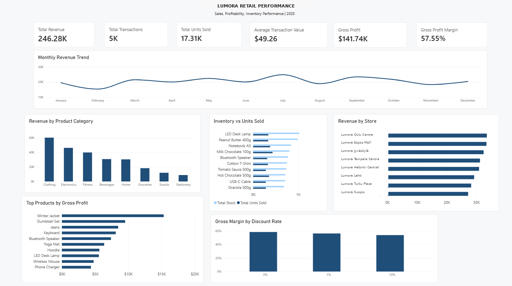

# Lumora Retail Analytics

A retail analytics portfolio project built to demonstrate how **PostgreSQL, SQL and Power BI** can be used to turn transactional, product, store and inventory data into practical business insights.

> **Dataset:** Synthetic 2025 retail dataset created for portfolio and learning purposes.

## 📊 Project Overview

Lumora Retail is a fictional multi-store retailer looking to improve sales performance, profitability, inventory decisions, supplier visibility and discount strategy.

The project follows an end-to-end analytics workflow:

**Business problem → Database design → Data generation → Data quality validation → SQL analysis → Power BI dashboard → Business insights**

## 🎯 Business Questions

The analysis addresses questions such as:

1. What drives revenue?
2. Which products generate the most revenue and gross profit?
3. Which stores perform best?
4. Which product categories contribute most to revenue and profit?
5. Which products may require inventory investigation?
6. How does supplier lead time relate to current stock exposure?
7. How do recorded discounts relate to gross margin?
8. What are the monthly sales patterns?

## 🛠️ Tools & Technologies

- **PostgreSQL / pgAdmin** — database design, data validation and SQL analysis
- **SQL** — joins, aggregations, CTEs, filtering and business analysis
- **Power BI** — data modelling, DAX and dashboard development
- **GitHub** — project documentation and portfolio presentation

## 📈 Key Performance Indicators

| KPI | Result |
|---|---:|
| Total Transactions | 5,000 |
| Total Units Sold | 17,309 |
| Total Revenue | €246,279.67 |
| Average Transaction Value | €49.26 |
| Gross Profit | €141,742.67 |
| Gross Profit Margin | 57.55% |

## 📊 Power BI Dashboard

The dashboard provides an executive view of:

- Monthly revenue trend
- Revenue by product category
- Revenue by store
- Top 10 products by gross profit
- Inventory versus units sold
- Gross margin by recorded discount rate



## 💡 Key Findings

### Product Performance

**Winter Jacket** generated the highest visible gross profit and revenue among the analysed products, while **Yoga Mat** recorded higher unit sales than Winter Jacket but generated substantially less revenue.

This highlights an important retail distinction:

**High sales volume does not automatically mean high revenue or high profitability.**

### Store Performance

**Oulu Centre** recorded the highest revenue and gross profit in the dataset, while transaction volume and unit volume varied across stores.

### Category Performance

**Clothing** generated the highest category revenue and gross profit, while **Groceries** recorded the highest unit volume.

This demonstrates why volume and value should be analysed separately.

### Discounts

Gross margin decreased across the recorded discount levels:

| Recorded Discount | Gross Margin |
|---|---:|
| 0% | 58.3% |
| 5% | 56.1% |
| 10% | 53.7% |

This is an **association within the dataset, not proof that discounts caused the margin change**.

### Inventory

Current stock was compared with full-period units sold to identify products that may warrant further inventory investigation.

Because inventory is a point-in-time snapshot while sales cover the full period, these results should be treated as **exploratory indicators rather than definitive overstock or stock-out conclusions**.

## 📁 Project Structure

```text
lumora-Retail-Analytics/
│
├── README.md
│
├── Documentation/
│   └── Lumora_Retail_Analytics_Case_Study.docx
│
├── Images/
│   └── dashboard.png
│
├── PowerBI/
│   └── Lumora_Retail_Dashboard.pbix

📄 Analysis Included
The SQL analysis covers:
1. Data quality checks
2. Overall business performance
3. Product performance
4. Store performance
5. Category performance
6. Customer performance
7. Discount analysis
8. Inventory versus sales
9. Supplier analysis
10. Monthly revenue
11. Revenue reconciliation
12. Top products by gross profit
⚠️ Limitations
- The dataset is synthetic and does not represent Lumora Retail's actual operations.
- Discount analysis identifies an association and does not establish causation.
- Inventory is a current snapshot, while sales represent the full analysis period.
- Supplier lead time is descriptive and should not be interpreted as proof of supply-chain risk without additional demand and replenishment data.
- Customer analysis was performed in SQL but was not included as a dashboard visual.
🚀 Project Outcome
This project demonstrates an end-to-end approach to business analytics: starting with a business problem, designing and validating a relational dataset, using SQL to answer business questions, and communicating the results through an executive Power BI dashboard.
Skills demonstrated: SQL • PostgreSQL • Data Cleaning • Data Quality • Data Analysis • Business Intelligence • Power BI • DAX • Data Visualisation • Business Communication
│
└── SQL/
    └── Lumora_Retail_Analysis.sql
